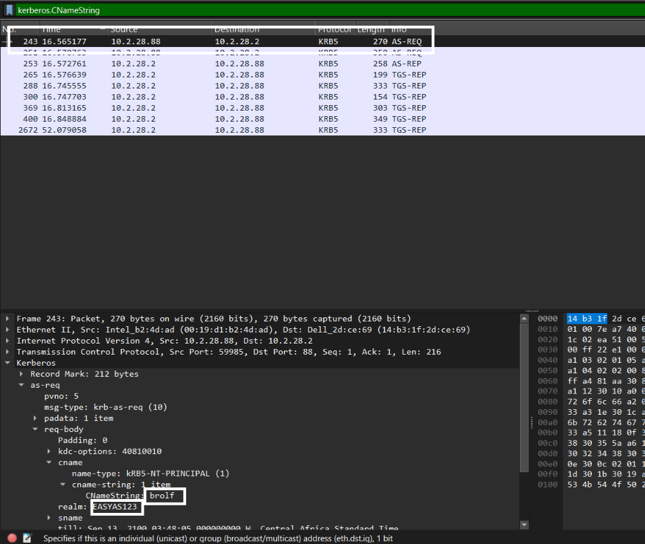

# Home SOC Lab: PCAP Malware & Network Intrusion Analysis

## Project Overview
This project simulates the end-to-end workflow of a Tier-1 Security Operations Center (SOC) Analyst and Digital Forensics / Incident Response (DFIR) Specialist. 

Rather than relying on simulated synthetic lab traffic, this investigation analyzes a real-world malware infection capture file (`2026-02-28-traffic-analysis-exercise.pcap`). The primary goal is to isolate the victim environment, reconstruct the attacker's infection chain, extract malicious payload binaries, isolate Command & Control (C2) channels, and author functional Suricata Intrusion Detection System (IDS) signatures to defend an enterprise network.

---

## Dataset & Investigation Prerequisites
* **Source Dataset:** [Malware-Traffic-Analysis.net](https://www.malware-traffic-analysis.net/)
* **Target Capture:** `2026-02-28-traffic-analysis-exercise.pcap`
* **Analysis Toolkit:** Wireshark (DPI), NetworkMiner (Passive Forensics), Zui / Brim (Zeek Log Parsing), Suricata (IDS Engine), VirusTotal (OSINT)

---

## Repository Deliverables
```text
.
├── README.md                          <-- Executive Summary, Victim Triage & Technical Findings
├── reports/
│   └── Incident_Response_Report.pdf   <-- Formal Incident Post-Mortem Report (Pending phase 4)
├── rules/
│   └── custom_detection.rules         <-- Custom Suricata Detection Signatures (Pending phase 3)
├── iocs/
│   └── iocs.txt                       <-- Defanged Indicators of Compromise (Pending phase 2)
└── screenshots/                       <-- Forensic Evidence Screenshots
    ├── kerberos.png
    ├── log_triage_http.png
    └── NetworkMiner_cross_validation.png
```

## Phase 1: Network Triage & Victim Host Identification 

### Executive Summary
During the initial network triage of capture file 2026-02-28-traffic-analysis-exercise.pcap, an internal endpoint exhibited anomalous traffic patterns. Using deep packet inspection (Wireshark) and passive network forensics (NetworkMiner, Zui), the compromised victim machine, physical MAC address, network identity, Active Directory domain, and active user account were successfully isolated and cross-verified.

### Compromised Host Identity

| Asset Parameter | Extracted Value | Analysis Source & Method |
| :--- | :--- | :--- |
| **Victim IP Address** | `10.2.28.88` | Wireshark (`Statistics -> Endpoints -> IPv4`) |
| **Victim MAC Address** | `00:19:d1:b2:4d:ad` | Layer 2 Ethernet Frame Headers |
| **Host System Name** | `DESKTOP-TEYQ2NR` | NetBIOS (NBNS Name Registration) |
| **Active Directory Domain** | `EASYAS123` | Kerberos AS-REQ (`realm`) |
| **Compromised User Account** | `brolf` | Kerberos AS-REQ (`cname-string`) |

> **Verification Note:** All extracted host identifiers and Kerberos user credentials were cross-validated using **NetworkMiner's** passive parsing engine (`Hosts` and `Credentials` tabs). NetworkMiner confirmed the exact IP Address, operating system TTL signatures, computer name (`DESKTOP-TEYQ2NR`), and Active Directory account (`brolf`) without requiring manual display filters.


---

### Technical Evidence & Forensic Findings

#### 1. Identity Extraction via Kerberos Authentication Requests
By applying the display filter `kerberos.CNameString` in Wireshark, Authentication Service Requests (`AS-REQ`) originating from IP `10.2.28.88` toward Domain Controller `10.2.28.2` were inspected. Parsing the `req-body` structures revealed the user account name (`brolf`) and realm (`EASYAS123`).



#### 2. Log Indexing & Web Traffic Summarization via Zui
To isolate web traffic without performance degradation, the capture was indexed in **Zui**. Querying the Zeek HTTP logs (`_path=="http" | cut ts, id.orig_h, id.resp_h, host, uri`) revealed recurring outbound HTTP web requests originating from victim host `10.2.28.88` directed toward an external IP address (`45.131.214[.]85`), flagging this external endpoint for deep payload inspection.


### Investigation Roadmap & Status
- [x] Phase 1: Network Triage & Victim Host Identification
- [ ] Phase 2: Attack Chain Reconstruction & Payload Binary Extraction
- [ ] Phase 3: Command & Control (C2) Identification & Suricata Rule Engineering
- [ ] Phase 4: Formal Incident Response Report Compilation
- [ ] Phase 5: Final Code Quality & Portfolio Publishing