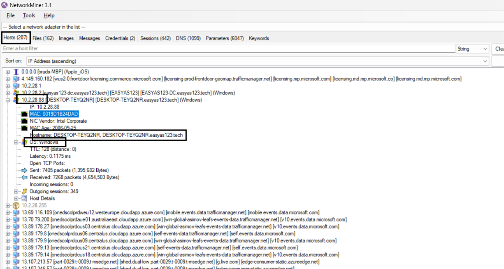
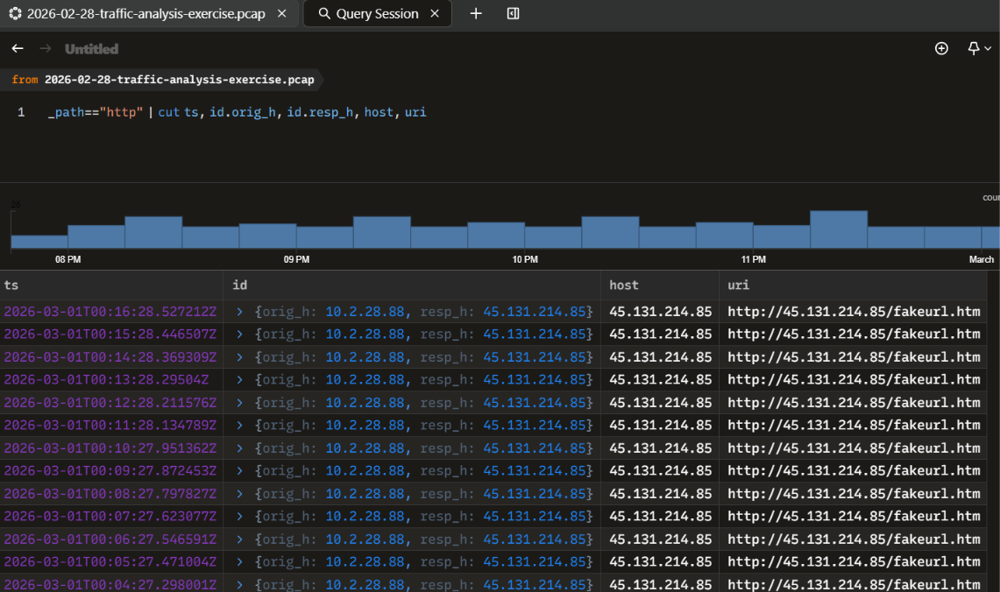
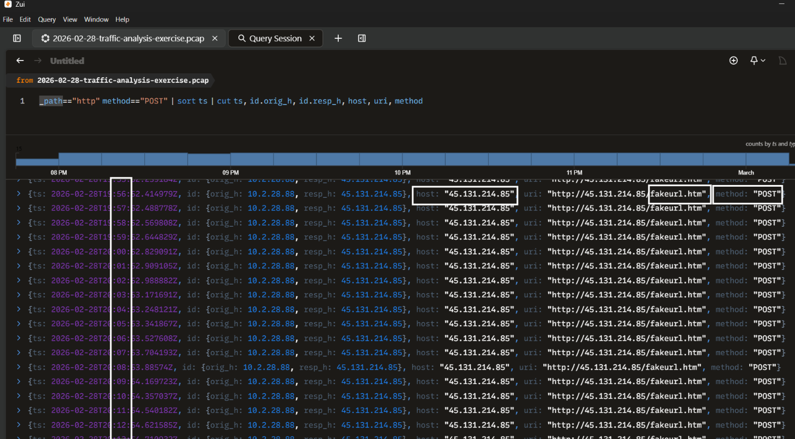
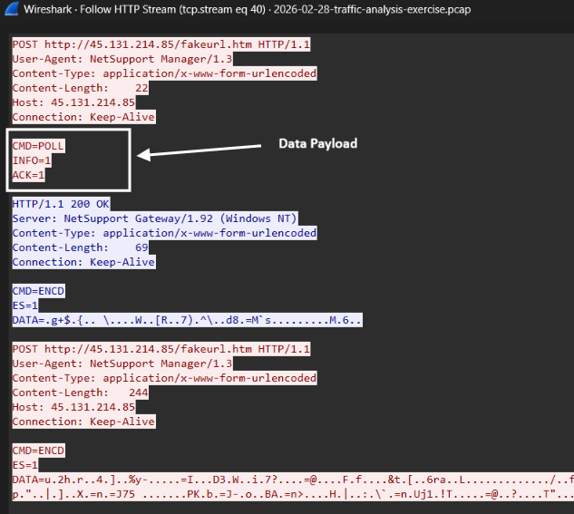
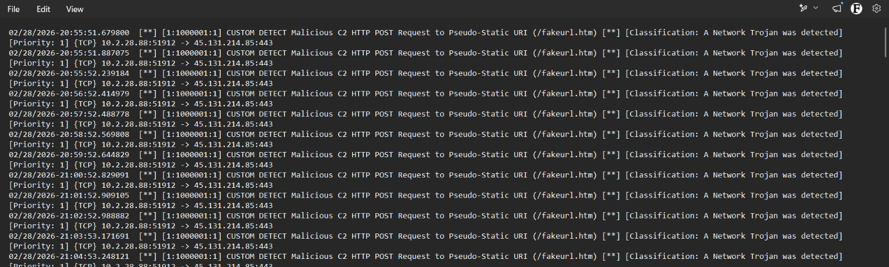
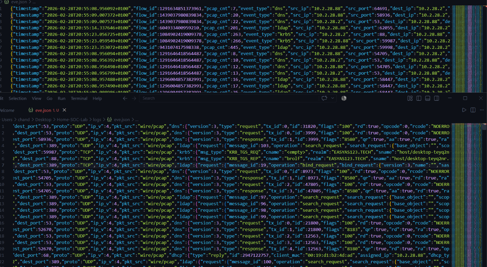

# Home SOC Lab: PCAP Malware & Network Intrusion Analysis

## Project Overview

This project simulates the end-to-end workflow of a **Tier-1 Security Operations Center (SOC) Analyst** and **Digital Forensics / Incident Response  Specialist**.

Rather than relying on simulated synthetic lab traffic, this investigation analyzes a real-world NetSupport RAT malware infection capture (`2026-02-28-traffic-analysis-exercise.pcap`). The primary goal is to isolate the victim environment, reconstruct the attacker's infection chain, analyze active HTTP Command & Control (C2) beaconing, author functional Suricata Intrusion Detection and Prevention System (IDS/IPS) rules, and deploy automated host firewall containment scripts to defend an enterprise network.

        

---

## Dataset & Investigation Prerequisites
* **Source Dataset:** [Malware-Traffic-Analysis.net](https://www.malware-traffic-analysis.net/)
* **Target Capture:** `2026-02-28-traffic-analysis-exercise.pcap`
* **Analysis Toolkit:** Wireshark (DPI), NetworkMiner (Passive Forensics), Zui / Brim (Zeek Log Parsing), Suricata (IDS Engine), VirusTotal (OSINT)

---

## Repository Deliverables
```text
.
├── README.md                          <-- Executive Summary, Victim Triage & Technical Findings
├── reports/
│   └── Incident_Response_Report.pdf   <-- Formal Incident Post-Mortem Report 
├── rules/
│   └── custom_detection.rules         <-- Custom Suricata Detection Signatures 
├── iocs/
│   └── iocs.txt                       <-- Defanged Indicators of Compromise 
├── scripts/
│   └── block_c2_infrastructure.ps1    <-- Automated Windows Containment Script
└── screenshots/                       <-- Forensic Evidence Screenshots
    
```

## Phase 1: Network Triage & Victim Host Identification 

### Executive Summary
During the initial network triage of capture file 2026-02-28-traffic-analysis-exercise.pcap, an internal endpoint exhibited anomalous traffic patterns. Using deep packet inspection (Wireshark) and passive network forensics (NetworkMiner, Zui), the compromised victim machine, physical MAC address, network identity, Active Directory domain, and active user account were successfully isolated and cross-verified.

### Compromised Host Identity

| Asset Parameter | Extracted Value | Analysis Source & Method |
| :--- | :--- | :--- |
| **Victim IP Address** | `10.2.28.88` | Wireshark (`Statistics -> Endpoints -> IPv4`) |
| **Victim MAC Address** | `00:19:d1:b2:4d:ad` | Layer 2 Ethernet Frame Headers |
| **Host System Name** | `DESKTOP-TEYQ2NR` | NetBIOS (NBNS Name Registration) |
| **Active Directory Domain** | `EASYAS123` | Kerberos AS-REQ (`realm`) |
| **Compromised User Account** | `brolf` | Kerberos AS-REQ (`cname-string`) |

> **Verification Note:** All extracted host identifiers and Kerberos user credentials were cross-validated using **NetworkMiner's** passive parsing engine (`Hosts` and `Credentials` tabs). NetworkMiner confirmed the exact IP Address, operating system TTL signatures, computer name (`DESKTOP-TEYQ2NR`), and Active Directory account (`brolf`) without requiring manual display filters.



---

### Technical Evidence & Forensic Findings

#### 1. Identity Extraction via Kerberos Authentication Requests
By applying the display filter `kerberos.CNameString` in Wireshark, Authentication Service Requests (`AS-REQ`) originating from IP `10.2.28.88` toward Domain Controller `10.2.28.2` were inspected. Parsing the `req-body` structures revealed the user account name (`brolf`) and realm (`EASYAS123`).


#### 2. Log Indexing & Web Traffic Summarization via Zui
To isolate web traffic without performance degradation, the capture was indexed in **Zui**. Querying the Zeek HTTP logs (`_path=="http" | cut ts, id.orig_h, id.resp_h, host, uri`) revealed recurring outbound HTTP web requests originating from victim host `10.2.28.88` directed toward an external IP address (`45.131.214[.]85`), flagging this external endpoint for deep payload inspection.



---

## Phase 2: Attack Chain Analysis & OSINT Threat Intelligence

### Executive Summary
Following the Phase 1 flag on `45.131.214[.]85`, the HTTP traffic was analyzed in more depth. Zeek log analysis in Zui exposed a regular beaconing pattern, the TCP conversation was reassembled to inspect the raw payloads, and the destination IP was checked against OSINT sources (VirusTotal and AbuseIPDB).

### Technical Evidence & Forensic Findings

#### 1. C2 Beaconing Detection via Zeek Log Analysis in Zui
Re-querying the Zeek HTTP logs with the method field added (`_path=="http" | cut ts, id.orig_h, id.resp_h, host, uri, method`) showed that the victim machine sends **POST requests every 60 seconds** to `45.131.214[.]85`.



**Anomalies detected:**
1. POST requests sent to a static HTML page
2. No DNS domain name (direct communication with an IP address)
3. Suspicious URL (`/fakeurl.htm`)

> **Conclusion:** The host is actively communicating with a Command & Control (C2) server at `45.131.214[.]85` through automated POST requests (**C2 beaconing**).

#### 2. TCP Stream Reassembly & Payload Analysis
The TCP conversation was reassembled to analyze the exact data payload sent by the victim host and the response returned by the C2 server.



| Characteristic | Extracted Value |
| :--- | :--- |
| **Protocol & Port** | HTTP over TCP port `443` |
| **User-Agent** | `NetSupport Manager/1.3` |
| **Content-Type** | `application/x-www-form-urlencoded` |
| **Payload Characteristics** | Starts in plaintext (`CMD=POLL`), then transitions to encrypted parameters (`CMD=ENCD`, `ES=1`) |

#### 3. OSINT Threat Intelligence (VirusTotal & AbuseIPDB)

**VirusTotal findings for `45.131.214[.]85`:**
* **Detections:** 8 security vendors flagged this IP address as malicious (alphaMountain.ai, BitDefender, Dr.Web, Fortinet, G-Data, Lionic, Sophos, VIPRE).
* **Relations:** Two files are communicating with this IP address:
  * `712c7e845543e6ddd07f724b6f9a9a0e2c84fdf6d8956fdd2bef94775b2ef707`
  * `c9e5bb7a368280d771edcfdb33717a3130560d2bb71773ab1aaffe0eb585fd2c`
* **Key forensic findings extracted from the comments:**

| Attribute | Value |
| :--- | :--- |
| **Threat Type** | `botnet_cc` |
| **Confidence Level** | 100% (security analysts and threat intelligence platforms have already verified this infrastructure as active malware host infrastructure) |
| **Country** | The Netherlands |

**AbuseIPDB findings:**
* **ISP (Internet Service Provider):** MHost LLC (hosting provider, similar to AWS)
* **Country of origin:** Germany
* **Reports:** No one has reported this IP address yet

---

  

## Phase 3: Rule Engineering

  

### Executive Summary

  

Create custom Suricata detection rules to automatically alert on this malicious activity in a Security Operations Center (SOC).

  

### Profiling C2 Artifacts in Wireshark

  

We already have the values we need for the rules:

| **Destination IP / Port** | `45.131.214.85` : `80` |

| **Target URI** | `/fakeurl.htm` |

| **HTTP Method** | `POST` |

| **User-Agent String** | `NetSupport Manager/1.3` |

| **Host Header** | `45.131.214.85` |

  

### Authoring Custom Suricata Rules

  

Now, we will write a targeted detection rule designed to catch this specific malware infection.

  

This rule triggers whenever the host sends an HTTP POST request to the `/fakeurl.htm` endpoint.

  

Rule added in the `rules` folder (`rules/custom_detection.rules`):

  

```text

alert http $HOME_NET any -> $EXTERNAL_NET any (msg:"CUSTOM DETECT Malicious C2 HTTP POST Request to URI (/fakeurl.htm)"; flow:established,to_server; http.method; content:"POST"; http.uri; content:"/fakeurl.htm"; fast_pattern; classtype:trojan-activity; sid:1000001; rev:1;)

```

  

### Testing & Validating Suricata Rules

  

We run Suricata offline directly against our `.pcap` file.

  

Executing Suricata in Windows CMD:

  

```text

& "C:\Program Files\Suricata\suricata.exe" -c "C:\Program Files\Suricata\suricata.yaml" -s rules\custom_detection.rules -r sample_infection.pcap -l logs

```

  

### Verifying Alert Outputs

  

Once Suricata finishes processing the PCAP, we check the generated alert logs.

  

#### Inspecting `fast.log` (Quick Text Summary)

  



  

#### Inspecting `eve.json` (Structured JSON Log)

  

```text

notepad logs\eve.json

```

  



---

## Phase 4: Active Prevention, IPS Drop Rules & Automated Host Firewall Mitigation

### Executive Summary
Transition from passive detection (IDS) to active prevention (IPS) by authoring a Suricata drop rule and building an automated Windows PowerShell Firewall script to immediately block C2 infrastructure at the endpoint level.

### Authoring a Suricata IPS Prevention Rule (drop)

```text
drop http $HOME_NET any -> $EXTERNAL_NET any (msg:"CUSTOM IPS DROP Malicious C2 Beaconing & Terminate Session (/fakeurl.htm)"; flow:established,to_server; http.method; content:"POST"; http.uri; content:"/fakeurl.htm"; fast_pattern; classtype:trojan-activity; sid:1000003; rev:1;)
```
To prevent detection evasion if the threat actor alters the HTTP URI endpoint (e.g., changing `/fakeurl.htm` to another path), three additional behavioral rules were authored and validated against the PCAP. 
 ```text 
Rule 2: Active IPS Drop - NetSupport RAT User-Agent (Survives URI Changes)
drop http $HOME_NET any -> $EXTERNAL_NET any (msg:"CUSTOM IPS DROP NetSupport RAT Outbound User-Agent"; flow:established,to_server; http.user_agent; content:"NetSupport Manager/1.3"; fast_pattern; classtype:trojan-activity; sid:1000004; rev:2;)

Rule 3: Active IPS Drop - Cleartext HTTP over Port 443 (Protocol Anomaly)
drop http $HOME_NET any -> $EXTERNAL_NET 443 (msg:"CUSTOM IPS DROP Cleartext HTTP Traffic over Non-Standard Port 443"; flow:established,to_server; classtype:bad-unknown; sid:1000005; rev:2;)

Rule 4: Active IPS Reject - C2 Domain DNS Query (Blocks Domain Resolution)
reject dns $HOME_NET any -> $EXTERNAL_NET 53 (msg:"CUSTOM IPS REJECT DNS Query for NetSupport C2 (vadusa.xyz)"; dns.query; content:"vadusa.xyz"; nocase; fast_pattern; classtype:trojan-activity; sid:1000006; rev:2;)
```

### Automated Windows Firewall Block Script (PowerShell)
To prevent any future packet from communicating with the C2 server `45.131.214[.]85`, we create a PowerShell script that acts as an automated host-based containment tool (`scripts/block_c2_infrastructure.ps1`).


### Testing & Validating Containment

Executed the automated block script (as Administrator):

```powershell
Set-ExecutionPolicy -ExecutionPolicy Bypass -Scope Process -Force
.\scripts\block_c2_infrastructure.ps1
```

Output:

```text
[*] Starting Incident Response Containment Action...
[+] Creating Outbound & Inbound Block Rules for C2 IP: 45.131.214.85
[SUCCESS] Host firewall rules applied successfully! Traffic to 45.131.214.85 is fully isolated.
```

Verifying the firewall rule:

```powershell
Get-NetFirewallRule -DisplayName "SOC-IR-BLOCK-C2-NetSupport-45.131.214.85-Outbound" | Get-NetFirewallAddressFilter
```


### Investigation Roadmap & Status
- [x] Phase 1: Network Triage & Victim Host Identification
- [x] Phase 2: Attack Chain Analysis & OSINT Threat Intelligence
- [x] Phase 3: Rule Engineering
- [x] Phase 4: Active Prevention, IPS Drop Rules & Automated Host Containment
- [x] Phase 5: Formal Incident Response Report Compilation 